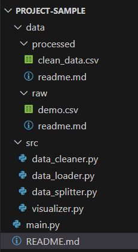

# Dự án Xử Lý & Trực Quan Dữ Liệu Python (OOP)

Viết theo mô hình hướng đối tượng (OOP) bằng Python.
- Thu thập dữ liệu (từ API, web, file CSV thô),
- Tiền xử lý dữ liệu (làm sạch, ép kiểu),
- Lưu dữ liệu đã xử lý,
- Và trực quan hóa dữ liệu một cách dễ dàng.

---

## Cấu trúc thư mục
```
my_project/
├── data/
│   ├── raw/              # Dữ liệu thô (crawled, API, CSV gốc)
│   └── processed/        # Dữ liệu đã xử lý
├── notebooks/            # Các notebook thử nghiệm trực quan
├── src/                  # Mã nguồn Python (chia theo lớp OOP)
│   ├── data_loader.py
│   ├── data_cleaner.py
│   ├── data_splitter.py
│   └── visualizer.py     # nếu làm công cụ khác thì không cần này
├── main.py               # Tập tin chính chạy pipeline
└── requirements.txt      # Các thư viện cần thiết
```

---
